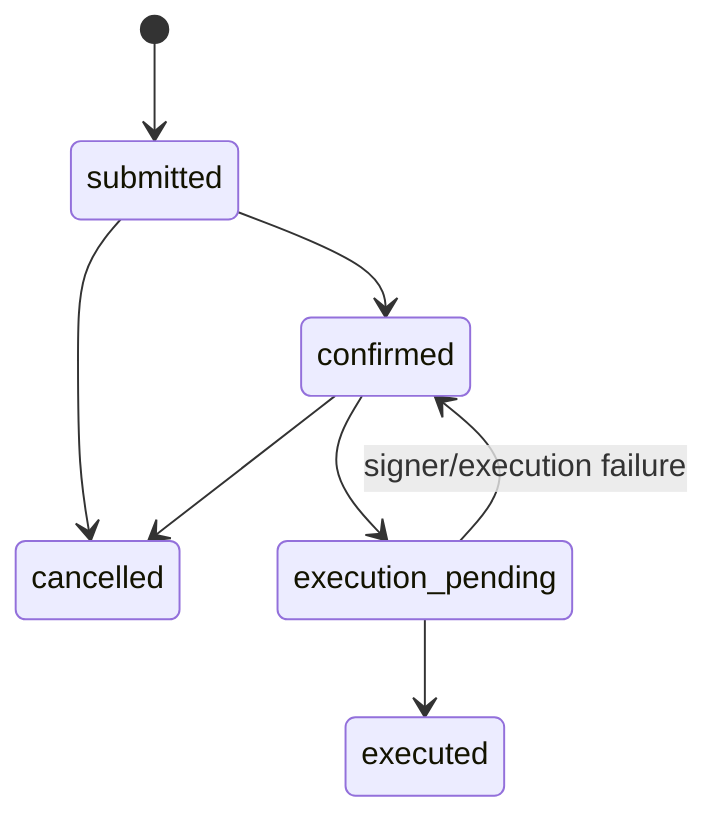

# BlackIce Execution Boundary

Issue [#139](https://github.com/redxzeta/blackice/issues/139) reframes BlackIce from an OpenClaw-facing policy router into the execution boundary for approved trading intents. This document captures the first implementation slice landed in this repository and the contract it establishes for follow-on work.

## What this slice adds

- A dedicated `/v1/intents` API for submitting, confirming, executing, cancelling, and listing trade intents.
- Pre-execution policy enforcement for venue allowlist, max notional, daily notional budget, and TTL.
- Signer and venue abstractions so custody and execution backends can be swapped without changing the route contract.
- An append-only audit trail per intent covering submission, confirmation, signing, execution, and cancellation events.
- Idempotent submission keyed by `idempotencyKey`.
- An authenticated execution-readiness contract for upstream autonomous systems.

This is intentionally a minimal vertical slice. Persistence is currently in memory and the default signer and venue executor are mock implementations targeting a `paper` venue. That keeps the contract concrete while leaving KMS/HSM integration, durable storage, and real venue adapters for follow-up PRs.

## Intent lifecycle



## API contract

### `GET /v1/execution-readiness`

Returns the current execution readiness gate used by upstream autonomous systems before any submit, confirm, or execute transition.

```json
{
  "ok": true,
  "accountId": "paper-account",
  "venue": "paper",
  "environment": "development",
  "signerReady": true,
  "credentialsReady": true,
  "geofenceAllowed": true,
  "complianceAllowed": true,
  "blockReasons": []
}
```

Blocked responses return `503` with machine-readable `blockReasons`: `account_missing`, `venue_not_allowed`, `signer_unavailable`, `credentials_unavailable`, `geofence_denied`, or `compliance_denied`. The endpoint is protected by the same bearer-token middleware as the intent routes.

### `POST /v1/intents`

Submit a pre-approved trade intent.

```json
{
  "idempotencyKey": "trade-approval-123",
  "accountId": "acct-primary",
  "market": "BTC-USD",
  "venue": "paper",
  "side": "buy",
  "quantity": 1,
  "notionalUsd": 25000,
  "ttlSeconds": 300
}
```

Returns the canonical intent record plus the active policy snapshot. Repeating the same `idempotencyKey` returns the existing record instead of creating a duplicate.

### `POST /v1/intents/:intentId/confirm`

Moves an intent from `submitted` to `confirmed`. This separates orchestration approval from actual execution.

### `POST /v1/intents/:intentId/execute`

Requests signing and order placement. In this slice it uses:

- `Signer.signIntent(intent)` to authorize signing
- `VenueExecutor.placeOrder(intent)` to create a normalized order record

Failures are recorded in the audit trail and leave the intent in `confirmed` so upstream systems can retry safely.

### `POST /v1/intents/:intentId/cancel`

Cancels a non-executed intent.

### `GET /v1/intents`
### `GET /v1/intents/:intentId`

Expose the normalized intent state, associated orders, and audit trail for reconciliation and inspection.

## Policy defaults in this slice

- Allowed venues: `paper`
- Max notional per intent: `$100,000`
- Daily notional budget: `$250,000`
- Max TTL: `86400` seconds

These defaults are code-level placeholders for now. A follow-up PR should move them into runtime config.

## Follow-on work

- Persist intents, orders, and audit events durably.
- Move policy thresholds and venue allowlists into runtime config.
- Replace the mock signer with a KMS/HSM-backed implementation.
- Add real venue adapters and a reconciliation loop for partial fills and cancels.
- Emit dedicated structured metrics and logs for audit and retry analysis.
