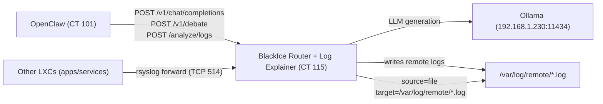

# BlackIce OpenClaw Policy Router


OpenAI-compatible policy/router server for OpenClaw.

- OpenClaw calls this server as its only provider.
- This server routes to local Ollama models.
- Supports CHAT (streaming) and ACTION (non-streaming) envelopes.

## Architecture


## Requirements
- Node.js 18+
- Ollama reachable at `http://<OLLAMA_HOST>:11434` (or set `OLLAMA_BASE_URL`)

## Install
```bash
npm install
npm run build
```

## Run
```bash
PORT=3000 \
OLLAMA_BASE_URL=http://<OLLAMA_HOST>:11434 \
ACTIONS_ENABLED=true \
LOG_LEVEL=info \
npm start
```

Dev mode:
```bash
npm run dev
```

## Source Layout
- Canonical runtime source lives in `src/` (TypeScript).
- Legacy root JavaScript modules were removed; runtime code should live under `src/` only.

## Endpoints
- `POST /v1/chat/completions`
- `POST /v1/debate`
- `POST /analyze/logs`
- `POST /v1/policy/dry-run`
- `GET /logs/recent`
- `GET /logs/metrics`
- `GET /version`
- `GET /healthz`

## Envelope Contract
Latest `user` message is interpreted as:

1. ACTION (single-line JSON object)
```json
{"action":"summarize|extract|transform|healthcheck|list_services|tail_log","input":"...","options":{...}}
```

2. CHAT (plain English text)

If ACTION parsing fails, request is treated as CHAT.

## Model Routing
- Code-related chat -> `qwen2.5-coder:14b`
- Long summary/rewrite chat -> `qwen2.5:14b`
- Default chat -> `llama3.1:8b`

## Actions
Read-only actions only:
- `healthcheck`
- `list_services`
- `tail_log` (allowlisted paths only)
- `summarize` / `extract` / `transform`

Security controls:
- no arbitrary shell execution
- fixed command allowlist
- child process timeouts
- path allowlist enforcement for logs

## Environment Variables
- `OLLAMA_BASE_URL` (default: `http://localhost:11434`)
- `OLLAMA_MODEL` (default: `qwen2.5:14b`)
- `PORT` (default: `3000`)
- `ACTIONS_ENABLED` (`true`/`false`, default `true`)
- `LOG_LEVEL` (`info`/`debug`, default `info`)
- `ALLOWLIST_LOG_PATHS` (comma-separated absolute files or directories)
- `ALLOWED_LOG_FILES` (comma-separated absolute files for `source: "file"` in `/analyze/logs`)
- `DEBATE_MODEL_ALLOWLIST` (comma-separated model IDs allowed for `/v1/debate`)
- `DEBATE_MAX_CONCURRENT` (default `1`; max active `/v1/debate` requests)
- `LOG_BUFFER_MAX_ENTRIES` (default `2000`; in-memory API log buffer size for `/logs/*`)
- `OPS_ENABLED` (`1` to expose `/logs/recent` and `/logs/metrics`; default disabled)
- `STREAM_SUPPRESS_TOOLISH` (`1` to suppress tool-call-like SSE payloads; default preserves raw output)
- `BUILD_GIT_SHA` (optional; exposed by `GET /version`)
- `BUILD_TIME` (optional ISO timestamp; exposed by `GET /version`)

## Quick Tests
Streaming CHAT:
```bash
curl -N -sS http://127.0.0.1:3000/v1/chat/completions \
  -H 'Content-Type: application/json' \
  -d '{
    "model": "router/default",
    "stream": true,
    "messages": [{"role":"user","content":"Explain swap memory in simple terms."}]
  }'
```

ACTION summarize:
```bash
curl -sS http://127.0.0.1:3000/v1/chat/completions \
  -H 'Content-Type: application/json' \
  -d '{
    "model": "router/default",
    "messages": [{"role":"user","content":"{\"action\":\"summarize\",\"input\":\"Docker host runs services for media, backups, and ingress.\",\"options\":{\"length\":\"short\"}}"}]
  }'
```

ACTION healthcheck:
```bash
curl -sS http://127.0.0.1:3000/v1/chat/completions \
  -H 'Content-Type: application/json' \
  -d '{
    "model": "router/default",
    "messages": [{"role":"user","content":"{\"action\":\"healthcheck\",\"input\":\"\",\"options\":{}}"}]
  }'
```

ACTION tail_log:
```bash
ALLOWLIST_LOG_PATHS=/var/log/syslog \
curl -sS http://127.0.0.1:3000/v1/chat/completions \
  -H 'Content-Type: application/json' \
  -d '{
    "model": "router/default",
    "messages": [{"role":"user","content":"{\"action\":\"tail_log\",\"input\":\"\",\"options\":{\"path\":\"/var/log/syslog\",\"lines\":50}}"}]
  }'
```


Policy dry-run (no model/action execution):
```bash
curl -sS http://127.0.0.1:3000/v1/policy/dry-run \
  -H 'Content-Type: application/json' \
  -H 'x-request-id: demo-dryrun-001' \
  -d '{
    "model": "router/default",
    "stream": true,
    "messages": [{"role":"user","content":"Explain RAID levels in simple terms."}]
  }'
```

Example response shape:
```json
{
  "mode": "dry_run",
  "execute": false,
  "envelope": {"kind": "chat", "raw": "Explain RAID levels in simple terms."},
  "route": {
    "kind": "chat",
    "workerModel": "llama3.1:8b",
    "reason": "default_general",
    "stream": true
  }
}
```

Debate route:
```bash
curl -sS -i http://127.0.0.1:3000/v1/debate \
  -H 'Content-Type: application/json' \
  -H 'x-request-id: demo-debate-001' \
  -d '{
    "topic": "Should homelabs prioritize reliability over experimentation?",
    "moderatorInstruction": "Keep arguments technical and concise.",
    "modelA": "llama3.1:8b",
    "modelB": "qwen2.5:14b",
    "rounds": 3,
    "turnsPerRound": 4,
    "includeModeratorSummary": true
  }'
```

Log Explainer route:
```bash
curl -sS http://127.0.0.1:3000/analyze/logs \
  -H 'Content-Type: application/json' \
  -d '{
    "source": "journalctl",
    "target": "sshd.service",
    "hours": 6,
    "maxLines": 300
  }'
```

Recent API logs:
```bash
curl -sS "http://127.0.0.1:3000/logs/recent?limit=100"
```

API metrics (last 1 hour):
```bash
curl -sS "http://127.0.0.1:3000/logs/metrics?window=1h"
```

Runtime version:
```bash
curl -sS "http://127.0.0.1:3000/version"
```

## OpenClaw Provider Setup
- Base URL: `http://<router-host>:3000/v1`
- Provider type: OpenAI-compatible
- Model: `router/default`
- API key: placeholder if UI requires one

## Notes
- Full product document: `PRODUCT_READINESS.md`
- OpenClaw Log Explainer integration: `OPENCLAW_LOG_EXPLAINER.md`
- Phase 2 multi-LXC handoff: `PHASE2_LXC_LOG_EXPOSURE_HANDOFF.md`

## Versioning And Tags
- Automatic patch release on PR merge to `main`:
```bash
# Implemented via .github/workflows/auto-version-on-merge.yml
# Behavior: bump patch, commit, create v* tag, push with --follow-tags
# Also creates a GitHub Release with generated notes
```
- Semver release tags (creates commit + tag):
```bash
npm run version:patch
# or: npm run version:minor
# or: npm run version:major
git push origin main --follow-tags
```
- Change tags for non-release checkpoints (tag current commit only):
```bash
npm run tag:change
git push origin main --tags
```

Repository setting needed:
- `Actions` must have permission to write repository contents (for push + tags).
