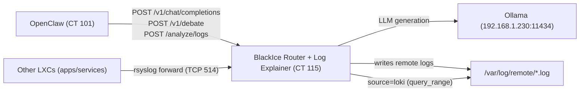

# BlackIce OpenClaw Policy Router


OpenAI-compatible policy/router server for OpenClaw.

- OpenClaw calls this server as its only provider.
- This server routes to local Ollama models.
- Supports CHAT (streaming) and ACTION (non-streaming) envelopes.

## Architecture

```mermaid
flowchart LR
  OC["OpenClaw (CT 101)"]
  BI["BlackIce Router + Log Explainer (CT 115)"]
  OL["Ollama (192.168.1.230:11434)"]
  LXC["Other LXCs (apps/services)"]
  RF["/var/log/remote/*.log"]

  OC -->|"POST /v1/chat/completions\nPOST /v1/debate\nPOST /analyze/logs"| BI
  BI -->|"LLM generation"| OL
  LXC -->|"rsyslog forward (TCP 514)"| BI
  BI -->|"writes remote logs"| RF
  BI -->|"source=loki (query_range)"| RF
```

## Requirements
- Node.js 18+
- Environment config YAML present (`BLACKICE_CONFIG_FILE`, default `./config/blackice.local.yaml`)

## Install
```bash
pnpm install
pnpm run build
```

`pnpm install` runs `pnpm run prepare`, which installs the local git hooks. If install scripts were skipped, run `pnpm run prepare` once to install them manually.

## Run
```bash
PORT=3000 \
BLACKICE_CONFIG_FILE=./config/blackice.local.yaml \
ACTIONS_ENABLED=true \
LOG_LEVEL=info \
pnpm start
```

Dev mode:
```bash
pnpm run dev
```

## Source Layout
- Canonical runtime source lives in `src/` (TypeScript).
- Legacy root JavaScript modules were removed; runtime code should live under `src/` only.

## Local Git Hooks
- `pre-commit` formats staged JS/TS/JSON files with Biome and re-stages the formatted content before the commit completes.
- `pre-push` checks files changed on the branch against `origin/main` and blocks the push if formatting drift remains.

## Endpoints
- `POST /v1/chat/completions`
- `POST /v1/debate`
- `GET /v1/debate/schema`
- `POST /analyze/logs`
- `POST /analyze/logs/batch`
- `GET /analyze/logs/targets`
- `GET /analyze/logs/status`
- `GET /analyze/logs/metadata`
- `POST /v1/policy/dry-run`
- `GET /logs/recent` *(requires `OPS_ENABLED=1`)*
- `GET /logs/metrics` *(requires `OPS_ENABLED=1`)*
- `GET /metrics` *(requires `METRICS_ENABLED=1`, default enabled; path configurable via `METRICS_EXPOSE_PATH`)*
- `GET /version`
- `GET /healthz`
- `GET /readyz`
- `GET /v1/models/check`
- `GET /health/loki`


## Envelope Contract
Latest `user` message is interpreted as:

1. ACTION (single-line JSON object)
```json
{"action":"summarize|extract|transform|healthcheck|list_services|tail_log","input":"...","options":{...}}
```

2. CHAT (plain English text)

If ACTION parsing fails, request is treated as CHAT.

## Model Routing
- Code-related chat -> `qwen2.5-coder:14b`
- Long summary/rewrite chat -> `qwen2.5:14b`
- Default chat -> `llama3.1:8b`

## Actions
Read-only actions only:
- `healthcheck`
- `list_services`
- `tail_log` (allowlisted paths only)
- `summarize` / `extract` / `transform`

Security controls:
- no arbitrary shell execution
- fixed command allowlist
- child process timeouts
- path allowlist enforcement for logs

## Environment Variables
Runtime and log collection settings are loaded from `BLACKICE_CONFIG_FILE` YAML. The old per setting environment variables for log explainer and Ollama tuning are no longer the active interface.

Top level environment variables:
- `PORT` (default: `3000`)
- `BLACKICE_CONFIG_FILE` (default: `./config/blackice.local.yaml`; use `./config/blackice.e2e.yaml` or `./config/blackice.prod.yaml`)
- `API_TOKEN` (optional; when set, all non exempt API routes require `Authorization: Bearer <token>`)
- `AUTH_EXEMPT_PATHS` (optional CSV; defaults to `/healthz,/readyz,/version`)
- `ACTIONS_ENABLED` (`true` or `false`, default `true`)
- `LOG_LEVEL` (`info` or `debug`, default `info`)
- `ALLOWLIST_LOG_PATHS` (comma separated absolute files or directories; defaults to `/var/log/syslog,/var/log/auth.log` for `tail_log`)
- `DEBATE_MODEL_ALLOWLIST` (comma separated model IDs allowed for `/v1/debate`)
- `DEBATE_MAX_CONCURRENT` (default `1`; max active `/v1/debate` requests)
- `LOG_BUFFER_MAX_ENTRIES` (default `2000`; in memory API log buffer size for `/logs/*`)
- `OPS_ENABLED` (`1` to expose `/logs/recent` and `/logs/metrics`; default disabled)
- `METRICS_ENABLED` (`1` or `0`; default `1`; controls the Prometheus metrics endpoint)
- `METRICS_EXPOSE_PATH` (default `/metrics`; HTTP path for Prometheus exposition)
- `STREAM_SUPPRESS_TOOLISH` (`1` to suppress tool call like SSE payloads; default preserves raw output)
- `READINESS_TIMEOUT_MS` (default `1500`; timeout in ms for `/readyz` Ollama probe, clamped to `100..10000`)
- `READINESS_STRICT` (`1` or `0`, default `1`; when `1`, `/readyz` returns `503` if upstream is unavailable)
- `MODEL_PREFLIGHT_ON_START` (`1` to fail startup when the configured Ollama model is missing; default `0`)
- `MODEL_PREFLIGHT_TIMEOUT_MS` (default `2000`; timeout in ms for `/v1/models/check` and startup preflight, clamped to `200..10000`)
- `BUILD_GIT_SHA` (optional; exposed by `GET /version`)
- `BUILD_TIME` (optional ISO timestamp; exposed by `GET /version`)

Runtime config YAML keys and current defaults:
- `limits.logCollectionTimeoutMs` (default `15000`; timeout for log collection commands)
- `limits.maxCommandBytes` (default `2000000`; maximum collected command output size in bytes)
- `limits.maxQueryHours` (default `168`; maximum log query lookback window in hours)
- `limits.maxLinesCap` (default `2000`; maximum returned log lines)
- `limits.maxConcurrency` (default `5`; max allowed batch concurrency)
- `limits.maxLogChars` (default `40000`; max log text sent into analysis prompts)
- `ollama.baseUrl` (default `http://192.168.1.230:11434`)
- `ollama.model` (default `qwen2.5:14b`)
- `ollama.timeoutMs` (default `45000`)
- `ollama.retryAttempts` (default `2`)
- `ollama.retryBackoffMs` (default `1000`)
- `loki.baseUrl` (empty by default; enables Loki routes when set)
- `loki.rulesFile` (empty by default; required when `loki.baseUrl` is set)
- `loki.timeoutMs` (defaults to `limits.logCollectionTimeoutMs`, so `15000` unless overridden)
- `loki.maxWindowMinutes` (default `60`; max `start` and `end` window for Loki query mode)
- `loki.defaultWindowMinutes` (default `15`; default window when `start` and `end` are omitted)
- `loki.maxLinesCap` (defaults to `limits.maxLinesCap`, so `2000` unless overridden)
- `loki.maxResponseBytes` (defaults to `limits.maxCommandBytes`, so `2000000` unless overridden)
- `loki.requireScopeLabels` (default `true`; requires `host` or `unit` in query mode unless `allowUnscoped=true`)

Loki rules YAML format:
```yaml
job: journald
allowedLabels: [job, host, unit, app, service_name]
hosts: [owonto, uwuntu]
units: [openclaw.service, blackice-router.service, promtail.service]
# hostsRegex: "^prod-(api|worker)-\\d+$"
# unitsRegex: "^[a-z0-9-]+\\.service$"
```

Example file: `config/loki-rules.example.yaml`

Environment config files:
- `config/blackice.local.yaml`
- `config/blackice.e2e.yaml`
- `config/blackice.prod.yaml`

Config precedence:
- `BLACKICE_CONFIG_FILE` selects which YAML file is loaded.

## Testing
Run the full test suite:
```bash
pnpm test
```

Run only unit tests:
```bash
pnpm run test:unit
```

Run only integration tests:
```bash
pnpm run test:integration
```

Watch mode:
```bash
pnpm run test:watch
```

## Quick Tests
Optional bearer token auth:
```bash
API_TOKEN=supersecret AUTH_EXEMPT_PATHS=/healthz,/readyz,/version pnpm start

curl -sS http://127.0.0.1:3000/v1/chat/completions \
  -H 'Authorization: Bearer supersecret' \
  -H 'Content-Type: application/json' \
  -d '{
    "model": "router/default",
    "messages": [{"role":"user","content":"hi"}]
  }'
```

Streaming CHAT:
```bash
curl -N -sS http://127.0.0.1:3000/v1/chat/completions \
  -H 'Content-Type: application/json' \
  -d '{
    "model": "router/default",
    "stream": true,
    "messages": [{"role":"user","content":"Explain swap memory in simple terms."}]
  }'
```

ACTION summarize:
```bash
curl -sS http://127.0.0.1:3000/v1/chat/completions \
  -H 'Content-Type: application/json' \
  -d '{
    "model": "router/default",
    "messages": [{"role":"user","content":"{\"action\":\"summarize\",\"input\":\"Docker host runs services for media, backups, and ingress.\",\"options\":{\"length\":\"short\"}}"}]
  }'
```

ACTION healthcheck:
```bash
curl -sS http://127.0.0.1:3000/v1/chat/completions \
  -H 'Content-Type: application/json' \
  -d '{
    "model": "router/default",
    "messages": [{"role":"user","content":"{\"action\":\"healthcheck\",\"input\":\"\",\"options\":{}}"}]
  }'
```

ACTION tail_log:
```bash
ALLOWLIST_LOG_PATHS=/var/log/syslog \
curl -sS http://127.0.0.1:3000/v1/chat/completions \
  -H 'Content-Type: application/json' \
  -d '{
    "model": "router/default",
    "messages": [{"role":"user","content":"{\"action\":\"tail_log\",\"input\":\"\",\"options\":{\"path\":\"/var/log/syslog\",\"lines\":50}}"}]
  }'
```


Policy dry-run (no model/action execution):
```bash
curl -sS http://127.0.0.1:3000/v1/policy/dry-run \
  -H 'Content-Type: application/json' \
  -H 'x-request-id: demo-dryrun-001' \
  -d '{
    "model": "router/default",
    "stream": true,
    "messages": [{"role":"user","content":"Explain RAID levels in simple terms."}]
  }'
```

Example response shape:
```json
{
  "mode": "dry_run",
  "execute": false,
  "envelope": {"kind": "chat", "raw": "Explain RAID levels in simple terms."},
  "route": {
    "kind": "chat",
    "workerModel": "llama3.1:8b",
    "reason": "default_general",
    "stream": true
  }
}
```

Debate route:
```bash
curl -sS -i http://127.0.0.1:3000/v1/debate \
  -H 'Content-Type: application/json' \
  -H 'x-request-id: demo-debate-001' \
  -d '{
    "topic": "Should homelabs prioritize reliability over experimentation?",
    "moderatorInstruction": "Keep arguments technical and concise.",
    "modelA": "llama3.1:8b",
    "modelB": "qwen2.5:14b",
    "rounds": 3,
    "turnsPerRound": 4,
    "includeModeratorSummary": true
  }'
```

Debate schema route:
```bash
curl -sS http://127.0.0.1:3000/v1/debate/schema
```

Example response shape:
```json
{
  "type": "object",
  "description": "Input contract for POST /v1/debate",
  "required": ["topic", "modelA", "modelB"],
  "properties": {
    "topic": { "type": "string", "minLength": 3, "maxLength": 500 },
    "modelA": { "type": "string", "minLength": 1, "maxLength": 120 },
    "modelB": { "type": "string", "minLength": 1, "maxLength": 120 },
    "rounds": { "type": "integer", "minimum": 1, "maximum": 3, "default": 3 },
    "turnsPerRound": { "type": "integer", "minimum": 4, "maximum": 10, "default": 4 }
  },
  "notes": [
    "Winner is always decided by OpenClaw policy.",
    "Models must be present in DEBATE_MODEL_ALLOWLIST."
  ]
}
```

Log Explainer route:
```bash
curl -sS http://127.0.0.1:3000/analyze/logs \
  -H 'Content-Type: application/json' \
  -d '{
    "source": "journalctl",
    "target": "sshd.service",
    "hours": 6,
    "maxLines": 300
  }'
```

Log Explainer endpoint guide:
- Use `POST /analyze/logs` for one journald, journalctl, or docker target when you want a single analysis result.
- Use `POST /analyze/logs/batch` when you need to analyze multiple journald targets in one request, or query Loki with rule-validated `filters`.
- Use `GET /analyze/logs/targets` to list the synthetic Loki targets that are exposed for discovery.
- Use `GET /analyze/logs/status` for a compact capability summary including enabled endpoints, limits, and target counts.
- Use `GET /analyze/logs/metadata` for machine-readable route metadata, including request schema hints and response schema payloads.
- Use `GET /health/loki` to check Loki readiness when Loki-backed batch analysis is enabled.

Log Explainer status route:
```bash
curl -sS http://127.0.0.1:3000/analyze/logs/status
```

Example response shape:
```json
{
  "endpoints": [
    "GET /analyze/logs/targets",
    "GET /analyze/logs/status",
    "GET /analyze/logs/metadata",
    "GET /health/loki",
    "POST /analyze/logs",
    "POST /analyze/logs/batch"
  ],
  "limits": {
    "maxHours": 168,
    "maxLinesRequest": 5000,
    "maxLinesEffectiveCap": 5000,
    "batchConcurrencyMin": 1,
    "batchConcurrencyMax": 5,
    "loki": {
      "enabled": false,
      "timeoutMs": 15000,
      "maxWindowMinutes": 60,
      "defaultWindowMinutes": 15,
      "maxLinesCap": 5000,
      "maxResponseBytes": 1048576,
      "requireScopeLabels": false
    }
  },
  "targets": {
    "count": 0,
    "items": []
  },
  "llm": {
    "baseUrl": "http://127.0.0.1:11434",
    "model": "llama3.1",
    "timeoutMs": 45000,
    "retryAttempts": 2,
    "retryBackoffMs": 1000
  }
}
```

Log Explainer metadata route:
```bash
curl -sS http://127.0.0.1:3000/analyze/logs/metadata
```

Example response shape:
```json
{
  "name": "blackice-log-explainer",
  "version": 1,
  "description": "Read-only log analysis service for OpenClaw integration",
  "endpoints": {
    "targets": {
      "method": "GET",
      "path": "/analyze/logs/targets"
    },
    "status": {
      "method": "GET",
      "path": "/analyze/logs/status"
    },
    "metadata": {
      "method": "GET",
      "path": "/analyze/logs/metadata"
    },
    "healthLoki": {
      "method": "GET",
      "path": "/health/loki"
    },
    "analyze": {
      "method": "POST",
      "path": "/analyze/logs"
    },
    "batch": {
      "method": "POST",
      "path": "/analyze/logs/batch"
    }
  },
  "status": {
    "endpoints": [
      "GET /analyze/logs/targets",
      "GET /analyze/logs/status",
      "GET /analyze/logs/metadata",
      "GET /health/loki",
      "POST /analyze/logs",
      "POST /analyze/logs/batch"
    ],
    "limits": {
      "maxHours": 168,
      "maxLinesRequest": 5000,
      "maxLinesEffectiveCap": 5000,
      "batchConcurrencyMin": 1,
      "batchConcurrencyMax": 5,
      "loki": {
        "enabled": false,
        "timeoutMs": 15000,
        "maxWindowMinutes": 60,
        "defaultWindowMinutes": 15,
        "maxLinesCap": 5000,
        "maxResponseBytes": 1048576,
        "requireScopeLabels": false
      }
    },
    "targets": {
      "count": 0,
      "items": []
    },
    "llm": {
      "baseUrl": "http://127.0.0.1:11434",
      "model": "llama3.1",
      "timeoutMs": 45000,
      "retryAttempts": 2,
      "retryBackoffMs": 1000
    }
  },
  "schemas": {
    "analyzeLogsTargetsResponse": {},
    "analyzeLogsResponse": {},
    "analyzeLogsBatchResponse": {}
  }
}
```

Incremental Loki batch analysis route:
```bash
curl -sS http://127.0.0.1:3000/analyze/logs/batch \
  -H 'Content-Type: application/json' \
  -d '{
    "source": "loki",
    "filters": {"job":"journald","host":"owonto","unit":"blackice-router.service"},
    "contains": "request_id=",
    "sinceSeconds": 300,
    "limit": 200,
    "mode": "raw",
    "evidenceLines": 5
  }'
```

Use this incremental pattern for short rolling windows where a caller already knows the scope and wants fresh evidence without a full multi-target batch pass.

Loki batch analysis route (rule-validated filters):
```bash
curl -sS http://127.0.0.1:3000/analyze/logs/batch \
  -H 'Content-Type: application/json' \
  -d '{
    "source": "loki",
    "filters": {"job":"journald","host":"owonto","unit":"blackice-router.service"},
    "mode": "both",
    "contains": "request_id=",
    "regex": "status=(5..|4..)",
    "sinceSeconds": 900,
    "limit": 500,
    "evidenceLines": 10
  }'
```

Recent API logs:
```bash
curl -sS "http://127.0.0.1:3000/logs/recent?limit=100"
```

API metrics (last 1 hour):
```bash
curl -sS "http://127.0.0.1:3000/logs/metrics?window=1h"
```
### Metrics Window Parameter

The `/logs/metrics` endpoint accepts a `window` parameter that defines the time range for metrics aggregation.

Format:

<number><unit>

Supported units:
- s = seconds
- m = minutes
- h = hours
- d = days

Examples:

/logs/metrics?window=30m
/logs/metrics?window=1h
/logs/metrics?window=1d

If an invalid value is provided, the system falls back to the default window of **1 hour**.

Prometheus scrape endpoint:
```bash
curl -sS "http://127.0.0.1:3000/metrics"
```

Exported HTTP metrics:
- `blackice_http_requests_total{route,method,status}`
- `blackice_http_request_duration_ms_bucket{route,method,le}`
- `blackice_http_request_duration_ms_sum{route,method}`
- `blackice_http_request_duration_ms_count{route,method}`
- `blackice_inflight_requests{route}`

Histogram buckets in milliseconds:
- `5, 10, 25, 50, 100, 250, 500, 1000, 2500, 5000, +Inf`

Readiness check:


Readiness check:
```bash
curl -sS -i "http://127.0.0.1:3000/readyz"
```

Model availability check:
```bash
curl -sS "http://127.0.0.1:3000/v1/models/check"
curl -sS "http://127.0.0.1:3000/v1/models/check?model=qwen2.5:14b"
```

Runtime version:
```bash
curl -sS "http://127.0.0.1:3000/version"
```

## OpenClaw Provider Setup
- Base URL: `http://<router-host>:3000/v1`
- Provider type: OpenAI-compatible
- Model: `router/default`
- API key: placeholder if UI requires one

## Notes
- Full product document: `PRODUCT_READINESS.md`
- OpenClaw Log Explainer integration: `OPENCLAW_LOG_EXPLAINER.md`
- Phase 2 multi-LXC handoff: `PHASE2_LXC_LOG_EXPOSURE_HANDOFF.md`

## Versioning And Tags
- Automatic patch release on PR merge to `main`:
```bash
# Implemented via .github/workflows/auto-version-on-merge.yml
# Behavior: bump patch, commit, create v* tag, push with --follow-tags
# Also creates a GitHub Release with generated notes
```
- Semver release tags (creates commit + tag):
```bash
pnpm run version:patch
# or: pnpm run version:minor
# or: pnpm run version:major
git push origin main --follow-tags
```
- Change tags for non-release checkpoints (tag current commit only):
```bash
pnpm run tag:change
git push origin main --tags
```

Repository setting needed:
- `Actions` must have permission to write repository contents (for push + tags).
